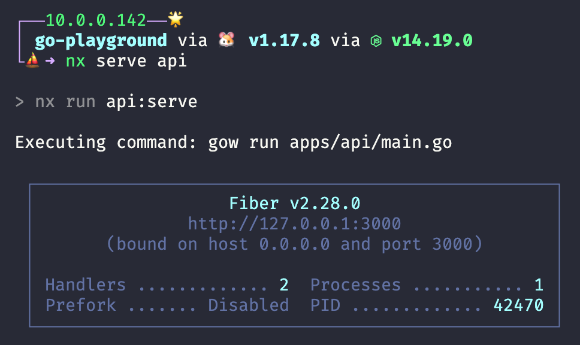
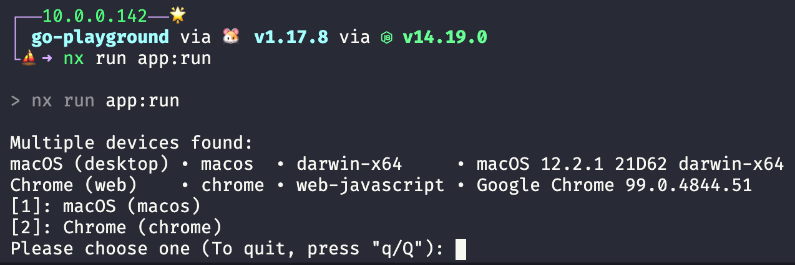
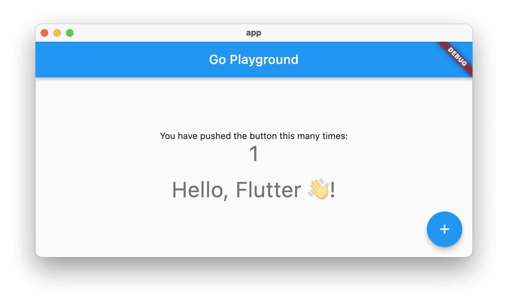

# go-playground

This project was generated using [Nx](https://nx.dev) with these plugins.

- [@nx-go/nx-go](https://github.com/nx-go/nx-go) for "**api**"
- [@nxrocks/nx-flutter](https://github.com/tinesoft/nxrocks/tree/master/packages/nx-flutter#readme) for "**app**"

```bash
yarn create nx-workspace go-playground --preset=empty --cli=nx --nx-cloud false

yarn add @nx-go/nx-go --dev
nx g @nx-go/nx-go:app api

yarn add @nxrocks/nx-flutter --dev
nx g @nxrocks/nx-flutter:create app
```


## Run

- Install [gow](https://github.com/mitranim/gow#installation) before running api in watch mode.
  
"**api**" is based on [fiber](https://github.com/gofiber/fiber) and runs on the port 3000 by the *nx serve api*


```bash
nx serve api
nx run app:run 
```

| **api**                                         | **app**
|-------------------------------------------------|-----------------------------------------------|
|  |  |

